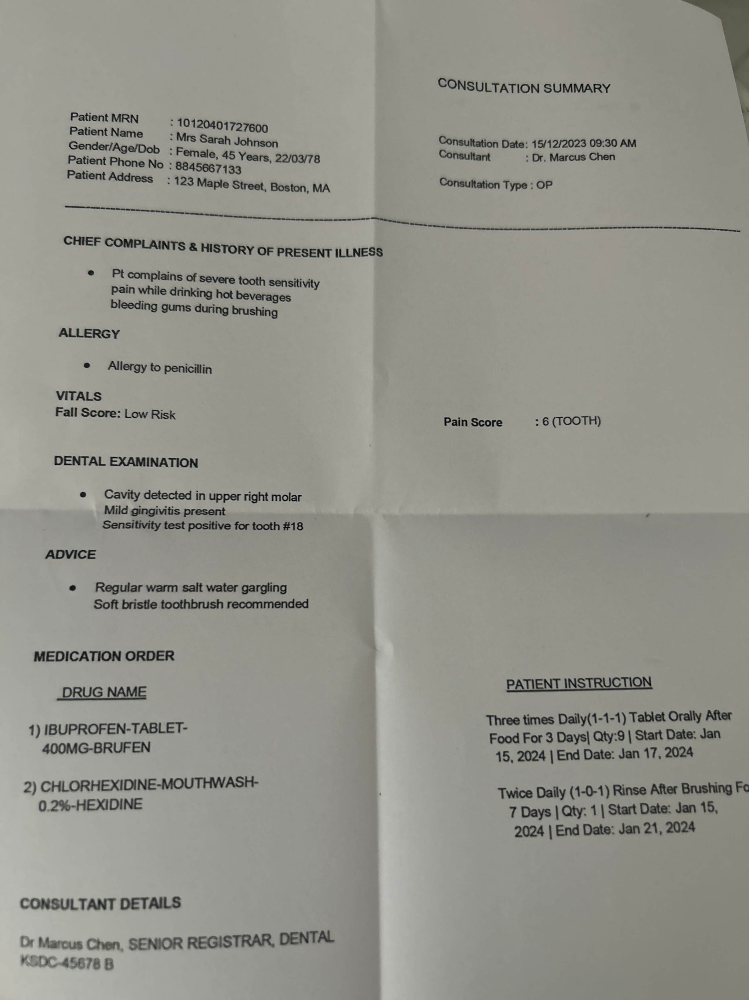

Input Image -->>

Generated Output -->> "{"patient_header":[{"type":"Consultation summary","Patient_MRN":"10120401727600","Consultation_Date":"15/12/2023 09:30 AM","Patient Name":"Mrs Sarah Johnson","Consultation":"Dr. Marcus Chen","Gender/Age/Dob":"Female, 45 Years, 22/03/78","Consultation Type":"OP","Patient Phone No":"8845667133","Patient Address":"123 Willow Street, Boston, MA"}],"patient_body":[{"CHIEF COMPLAINTS & HISTORY OF PRESENT ILLNESS":"Pt complains of severe tooth sensitivity pain while drinking hot beverages bleeding gums during brushing","ALLERGY":"Allergy to penicillin","VITALS":"Fall Score: Low Risk","Pain Score":"6 (TOOTH)","EXAMINATION":"Cavity detected in upper right molar Mild gingivitis present Sensitivity test positive for tooth #18","ADVICE":"Regular warm salt water gargling Soft bristle toothbrush recommended"}],"Medication_order":{"DRUG_NAME":[{"1":"IBUPROFEN-TABLET-400MG-BRUFEN","2":"CHLORHEXIDINE-MOUTHWASH-0.2%-HEXIDINE"}],"PATIENT_INSTRUCTION":[{"1":"Three times Daily(1-1-1) Tablet Orally After Food For 3 Days| Qty:9 | Start Date: Jan 15, 2024 | End Date: Jan 17, 2024","2":"Twice Daily (1-0-1) Rinse After Brushing For 7 Days | Qty: 1 | Start Date: Jan 15, 2024 | End Date: Jan 21, 2024"}]},"CONSULTANT_DETAILS":"Dr Marcus Chen, SENIOR REGISTRAR, DENTAL KSDC-45678 B"